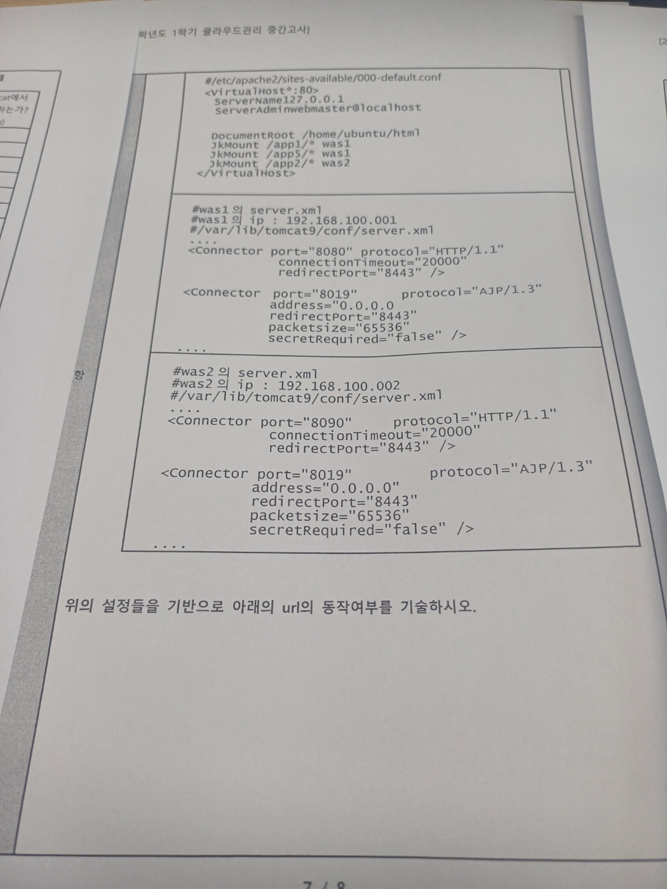
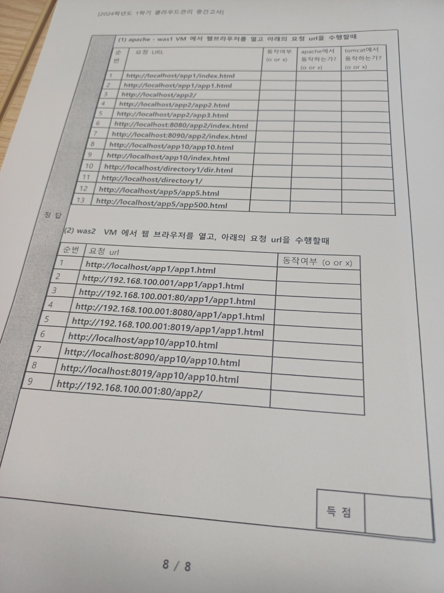
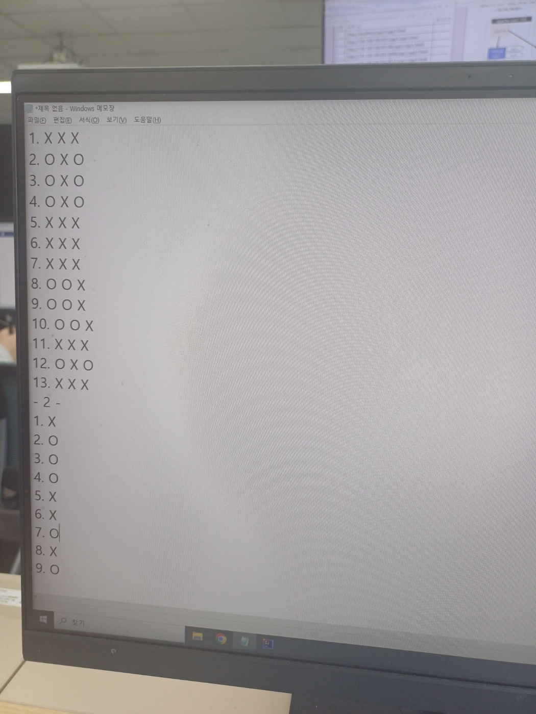

##### Apache 및 Tomcat을 잘 실행시키는 방법 3가지
1. Systemctl status
2. netstat -ntlp
3. 클라이언트 프로그램을 직접 연결

##### 3-Tier 아키텍쳐의 세가지 구성요소를 쓰고 설명하세요
- 장점

- 이렇게 해서 안정적으로 운영되는가?

- 나누는 이유

##### 웹 서버의 장점과 역할 작성
- 장점
    1. Static resource 처리를 빨리 해준다.
    2. WAS 서버의 주소 노출이 안되어 보안이 강화된다.(port번호를 숨길 수 있음)
    3. 여러 개의 WAS의 업무 분해해 주어 자원을 효율적으로 활용
- 역할
  1. Static resource
      - Web server에서 static resource를 다루고, WAS 서버에서 dynamic 정보를 다룬다.
      - DB까지 가지 않는 정보 전달. 그림파일, text 등
  2. Security
      - 방화벽 바깥에 webserver를 위치하고 WAS, DB서버는 방화벽 안쪽에 위치
      - SSL 처리
  3. Load balancing
      - 하나의 Webserver가 여러 개의 WAS 서버에게 업무 분배

##### 해당하는 포트가 잘 listen 하고 있는가?
- netstat -nplt

##### load balancer의 역할
- 네트워크 트래픽을 하나 이상의 서버나 장비로 분산하기 위해 사용되는 기술
- S/W나 H/W를 통해 로드 밸런싱을 수행할 수 있음
- 서비스 사용자의 요청을 서버로 분산해서 전달

##### Load Balancing 방식
- Round Robin의 방식에 대해 설명
    - 로드 밸런서에서 서버 선택 시, 순차적으로 서버를 선택하는 방법
- Weighted Round Robin의 방식에 대해 설명
    - 로드 밸런서에서 서버 선택 시, 비중에 따라서 서버를 선택하는 방법

|{: width="400" height="400"}
|--|
|{: width="400" height="400"}
|--|
|{: width="400" height="400"}
|--|
|{: width="400" height="400"}
|--|
